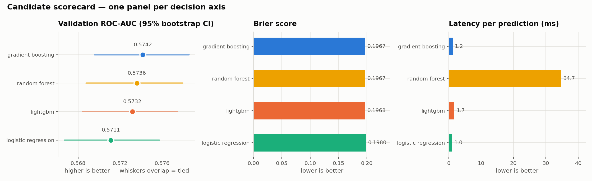
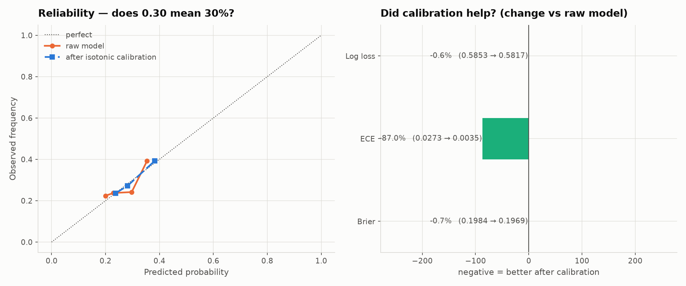
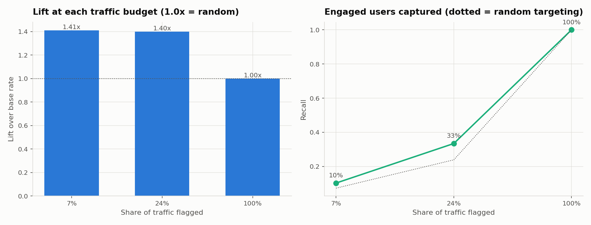
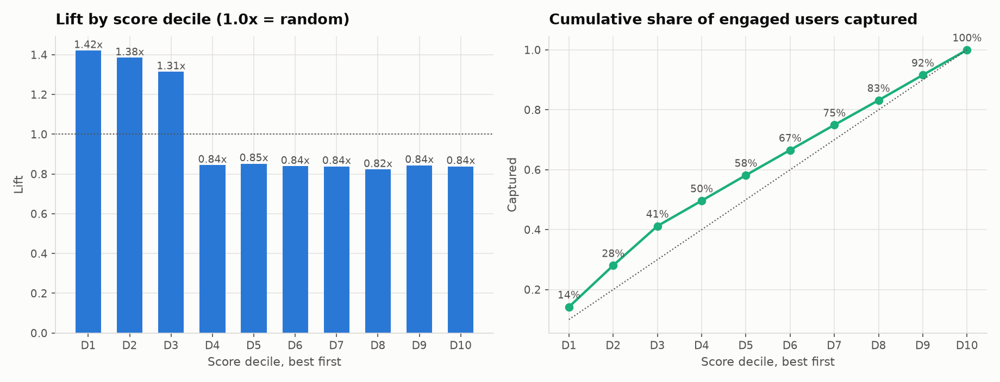
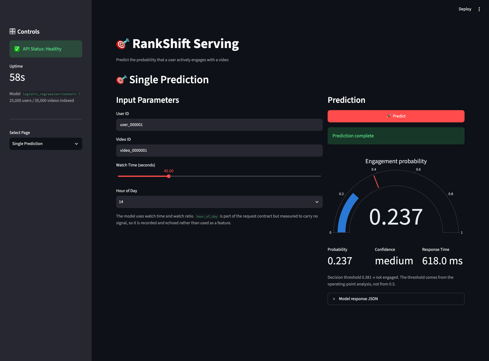

# Cognitive Shorts Recommendation System

[](https://github.com/PSCRedefine/SinglePrediction/actions/workflows/tests.yml)

**The problem.** A short-video platform logs every user-video interaction —
views, likes, comments, shares, follows, replays. That log is a record of what
already happened. It is worth far more if it can tell you what is *about* to
happen: which of the next million impressions is likely to earn engagement, and
which is not.

This project turns that log into an end-to-end ML system that answers the
question one request at a time, in production, with a calibrated probability.

*One of four in [a series](#the-series):*  **Single Prediction** → [Batch Prediction](https://github.com/PSCRedefine/BatchPrediction) → [Model Info](https://github.com/PSCRedefine/ModelInfo) → [Analytics Dashboard](https://github.com/PSCRedefine/AnalyticsDashboard)

```text
OFFLINE                    TRAINING                   ONLINE
raw interaction CSVs  →    feature table         →    front end takes 3 inputs
       │                        │                            │
       ▼                        ▼                            ▼
leakage-safe feature      four candidates,            backend derives the full
table, built by           compared by a               feature set, calls the
chunked streaming         statistical tie test        model, returns probability
with a schema contract    then by cost                and a confidence band
```

| Stage | What happens | Why it matters |
|---|---|---|
| **Offline** | Raw CSVs are streamed in chunks into a model-ready feature table, with leaking and unservable columns blocked by contract | The training table cannot contain anything a live request could not supply |
| **Training** | Four candidate models are compared, tied on a paired bootstrap, then separated on cost; the winner is calibrated and given an operating point | The choice is a measurement, not a preference |
| **Online** | The page collects three inputs; the service resolves identifiers, derives the features, and returns a probability with a confidence band | The caller supplies what a caller has, not what the model needs |

---

## Business value

**What it buys you.** At the recommended operating point the model flags 23.9%
of traffic and finds engaged users **1.40x more often than acting at random**.
Against a 28.1% base rate, precision on the flagged slice is 39.3%. For any
intervention with a per-impression cost — a push notification, a promoted slot,
a creator payout — that ratio is the difference between spending on a quarter
of traffic and spending on all of it.

**The probability is a rate, not a rank.** Calibration error is 0.0035, down
from 0.0273. A row scoring 0.38 means roughly 38 in 100 such rows engage, so
the output can be budgeted against and summed across a batch — not merely
sorted. Most engagement models cannot honestly claim this.

**It costs almost nothing to run.** The shipped model is 3 KB and scores a
request in a dot product. There is no GPU, no feature store, no model registry
in the serving path.

**And it tells you what not to build.** Twenty-three of twenty-five candidate
features — every user profile attribute, every video metadata field, time of
day — are statistically indistinguishable from noise on this data. Each one
would have cost a pipeline, a backfill and a monitoring surface to serve. The
measurement that ruled them out is the cheapest deliverable here.

## Technical value

| Concern | What was done | Instead of |
|---|---|---|
| **Leakage** | Chronological split; outcome columns and unservable columns blocked by explicit contract | A random split and an implicit feature list |
| **Model choice** | Paired bootstrap tie test — all four candidates statistically indistinguishable — then the cheapest of the tied set | Taking the highest validation AUC |
| **Probability quality** | Isotonic calibration, applied because it was measured to help, with its PR-AUC cost recorded | Shipping raw scores and calling them probabilities |
| **Decision threshold** | Chosen from an operating-point sweep and shipped in model metadata | Hard-coding 0.5, which on this model flags nothing at all |
| **Feature set** | 2 of 25, selected by measured contribution; the pruned model scores *higher* than the full one | Keeping every available column |
| **Operability** | `/health` stays serviceable when the model fails to load; 43 tests; containerised with a profile-gated trainer | A process that dies silently and a README that says "run it" |

**The honest headline.** On this dataset only watch behaviour predicts
engagement, and any truthful model is bounded at roughly 0.58–0.60 ROC-AUC.
That ceiling is stated up front and measured rather than asserted. A system
that reports a weak signal accurately is worth more than one that reports a
strong signal it does not have.

---

## Contents

- [Business value](#business-value)
- [Technical value](#technical-value)
- [Results](#results)
- [Pipeline](#pipeline)
- [Feature selection](#feature-selection)
- [Model selection](#model-selection)
- [The operating point](#the-operating-point)
- [Data and label definition](#data-and-label-definition)
- [Interface](#interface)
- [Repository layout](#repository-layout)
- [Quick start](#quick-start)
- [Deployment](#deployment)
- [Verification](#verification)
- [Limitations](#limitations)
- [References](#references)
- [The series](#the-series)

---

## Results

Measured on the latest 15% of the log by time, held out until the final report.

| Metric | Value | Note |
|---|---:|---|
| ROC-AUC | **0.5796** | against a ceiling of roughly 0.60 for this data |
| PR-AUC | 0.3267 | base rate 0.2807 |
| Brier | 0.1969 | after isotonic calibration |
| ECE | 0.0035 | calibration error, from 0.0273 before calibration |
| Features | **2** | selected from 25 candidates by measurement |
| Artefact | 0.002 MB | 1,958x smaller than the largest candidate |
| Recommended threshold | 0.3812 | flags 23.9% of traffic at **1.40x lift** |

The model is small, calibrated, and honest about a weak signal. That combination
is the deliverable.

---

## Pipeline

```text
interactions.csv (500k rows, 43 columns)      users.csv      videos.csv
             │                                     │              │
             ▼                                     ▼              ▼
   prepare_data.py     chunked streaming, Pandera contract check
             ▼
   processed_interactions.csv     500k rows x 2 features + label + split keys
                                  (8 columns; preview in docs/DATA_PREVIEW.md)
             ▼
   train.py            chronological split -> 4 candidates
                       -> paired-bootstrap tie test -> cost-based selection
                       -> calibration gate -> operating-point analysis
             ▼
   best_model.joblib · model_metadata.json · training_report.json · 6 figures
             ▼
   api.py              POST /predict · GET /health · GET /model/info
             ▼
   app.py              Streamlit: input validation, gauge, model info
```

---

## Feature selection

Full derivation and every measurement: **[docs/FEATURE_SELECTION.md](docs/FEATURE_SELECTION.md)**.
Reproduce with `python scripts/feature_selection.py`.

Each candidate is screened univariately with a bootstrap interval and
multivariately with permutation importance. A feature survives if either test
clears its threshold.

| Feature | ROC-AUC | 95% interval | Verdict |
|---|---:|---|---|
| `watch_time_seconds` | 0.5641 | [0.5623, 0.5660] | **keep** |
| `watch_ratio` | 0.5569 | [0.5551, 0.5588] | **keep** |
| `video_category` | 0.5065 | [0.5038, 0.5093] | drop |
| `user_country` | 0.5060 | [0.5033, 0.5085] | drop |
| `hour_of_day` | 0.5010 | [0.5000, 0.5034] | drop |
| *…20 more* | ≤0.5063 | all reaching 0.500 | drop |

Pruning costs nothing: the 25-feature model scores 0.5739 and the 2-feature model
0.5721, a gap of 0.0018 against a standard error of about 0.0045. The two are
indistinguishable, so the smaller one wins.

**Why the other features are noise.** `users.csv` and `videos.csv` share
identifier spaces with the interaction log but not attribute values. For the same
`user_id`, the age on the interaction row and the age in `users.csv` disagree on
**97.1%** of rows with a correlation of **0.0014**. Every shared field behaves
the same way. Joining those files attaches values unrelated to the interaction
being predicted — which is why a thirty-two-feature version of this project could
train without any metric revealing the problem.

**Leakage control.** `engagement_score` alone scores ROC-AUC **0.836**. It is
computed from the outcome and does not exist when a request arrives. It, the five
action columns, and `skipped_quickly` are excluded by an explicit blocklist in
`features.py`, and a test asserts the blocklist never intersects the feature set.

---

## Model selection

Four candidates across three model families, on the validation split:

| Model | ROC-AUC | 95% interval | Gap to leader | Latency | Artefact |
|---|---:|---|---|---:|---:|
| gradient_boosting | 0.5742 | [0.5696, 0.5786] | — | 1.23 ms | 0.196 MB |
| random_forest | 0.5736 | [0.5688, 0.5779] | [−0.0011, +0.0023] | 34.69 ms | 3.916 MB |
| lightgbm | 0.5732 | [0.5684, 0.5775] | [−0.0009, +0.0029] | 1.74 ms | 0.692 MB |
| **logistic_regression** | 0.5711 | [0.5667, 0.5757] | [−0.0002, +0.0060] | **1.03 ms** | **0.002 MB** |



Every gap interval contains zero: the four models are **statistically tied**. The
per-model standard error (~0.0045) exceeds the entire spread between them
(0.0031), so ranking by point estimate would ranks sampling noise and would flip
on a different seed.

The rule encoded in `train.py`:

```
1. Cost veto      latency > 50 ms or artefact > 100 MB -> disqualified
2. Tie test       paired bootstrap; gap interval containing 0 -> tied
3. Cheapest wins  among the tied, smallest artefact then lowest latency
```

Winner: **logistic regression**, 1,958x smaller and 34x faster than the random
forest with no measurable loss. This is the one-standard-error rule from CART
(Breiman et al., 1984) applied to operational cost.

The tie is itself the finding: four model families converging within noise means
the ceiling is set by the available signal, not by model capacity.

### Calibration



| Metric | Raw | Calibrated |
|---|---:|---:|
| Brier | 0.19840 | **0.19694** |
| ECE | 0.02725 | **0.00353** |

Isotonic calibration is fitted on validation and shipped only because Brier — a
strictly proper scoring rule — improved. ECE alone is not a sufficient gate: it
can be driven toward zero by collapsing every prediction to the base rate.

One consequence is documented rather than hidden: isotonic regression is a step
function, and at this signal level it collapses to **eight distinct output
probabilities**. Ranking is unaffected; threshold choice is quantised.

---

## The operating point



The calibrated model's maximum output is **0.389**. No prediction reaches 0.5, so
at the default threshold every candidate reports F1 = 0.0 — which is exactly the
degenerate result a previous version of this project shipped without noticing.
That was never a broken model; it was a broken threshold.

F1-optimisation does not rescue it. Across the sweep F1 peaks at threshold 0.01,
flagging 100% of traffic: on a weak-signal problem F1 collapses into "treat
everybody", which is true and useless as guidance.

The operating point is therefore chosen by budget:

| Traffic flagged | Threshold | Precision | Recall | Lift |
|---:|---:|---:|---:|---:|
| 7.3% | 0.3890 | 0.396 | 0.102 | 1.41x |
| **23.9%** | **0.3812** | **0.393** | **0.334** | **1.40x** |
| 100% | 0.2366 | 0.281 | 1.000 | 1.00x |

**Recommendation:** threshold 0.3812. Reaching a quarter of traffic selects a
group 1.40x richer in engaged users than random, capturing a third of all
engagement. `/predict` returns this threshold explicitly, and `predicted_engaged`
is computed against it rather than against 0.5.



The decile table shows where the signal lives: the top three deciles run at
1.33–1.41x lift and hold 41% of engaged users, while deciles four through ten are
flat at about 0.85x. The model separates a top ~30% and is uninformative below
that — which is worth knowing before promising more.

---

## Data and label definition

| File | Rows | Content |
|---|---:|---|
| `data/interactions.csv` | 500,000 | View log with timestamps, sessions and outcomes |
| `data/users.csv` | 25,000 | User profiles |
| `data/videos.csv` | 35,000 | Video metadata |
| `data/processed_interactions.csv.gz` | 500,000 | **Committed** feature table — the only input `train.py` reads |

> **Data preview:** [docs/DATA_PREVIEW.md](docs/DATA_PREVIEW.md) — schema, first rows,
> distributions and null counts for the generated table, plus a 20-row
> [sample CSV](docs/processed_interactions_sample.csv) you can open directly. The full
> processed table is committed as `data/processed_interactions.csv.gz` (12 MB), so
> training reproduces from a clean clone; only the 139 MB raw log is excluded.

**Label.** `target_engaged = liked OR shared OR commented OR followed_creator OR
replayed`. Positive rate **27.79%**.

**Split.** Chronological: earliest 70% train, next 15% validation, latest 15%
test. The log spans 2025-07-14 to 2025-08-14, so this matches production, where
the past predicts the future.

The training script also fits the winner on a random split and reports both.
Chronological test ROC-AUC is 0.5796 against 0.5770 for the random split — a
difference of −0.0026. **The expected optimism did not materialise**: this data
has no material temporal drift. The chronological split is kept because it is the
one that matches production and will show drift the day it appears, but the
honest report is that it changed nothing here.

`interactions.csv` is 139 MB, above GitHub's 100 MB single-file limit, and is
excluded by `.gitignore`. It is only needed to re-run `prepare_data.py` and
`feature_selection.py`; everything from `train.py` onwards runs from the
committed `.gz`, and the trained model, metadata and reports are committed too.

---

## Interface



Client-side format validation (specification §7.1) rejects a malformed identifier
before any network call, so a typo produces an immediate message rather than a
round trip and a 422. The server repeats the check — that copy is the one that
protects the service.

---

## Repository layout

```text
app.py                            Streamlit front end
Dockerfile, docker-compose.yml    one image: train, api, console
src/single_prediction/
  config.py                      paths and thresholds, all env-overridable
  features.py                    the feature contract and blocklists
  prepare_data.py                chunked offline feature table construction
  train.py                       candidate comparison, tie test, calibration, operating points
  metrics.py                     discrimination, calibration, operating-point analysis
  api.py                         /predict · /health · /model/info
  plots.py                       six figures, regenerated by train.py
scripts/
  feature_selection.py           the measurement behind the two-feature model
  prepare_data.py / train_models.py   CLI entry points
monitoring/
  monitoring.yaml                thresholds derived from the training run
  check_drift.py                 PSI input drift, output drift, with a self-test
docs/
  DEPLOYMENT.md                  running it, locally and in containers
  DATA_PREVIEW.md                schema and sample of the generated table
  processed_interactions_sample.csv   first 20 rows, openable in any viewer
  FEATURE_SELECTION.md           why two features
  DESIGN_DECISIONS.md            seven ADRs
  API.md                         endpoint contract
  PRODUCTION_READINESS.md        what it would need to carry real traffic
tests/                           43 tests covering specification §9.2 in full
image/                           figures
reports/                         feature_selection.json, training_report.json
```

---

## Quick start

Python 3.11–3.13. The code uses `datetime.UTC`, which 3.10 does not have.

```bash
python3.12 -m venv .venv
source .venv/bin/activate
python -m pip install -r requirements-dev.txt
python -m pip install -e .
```

Everything below runs from a clean clone — the processed dataset
(`data/processed_interactions.csv.gz`), the trained model and the reports are
committed:

```bash
python -m single_prediction.train --input data/processed_interactions.csv.gz
                                             # ~1 min, retrains and rewrites models/ reports/
pytest -q                                    # 43 passed
python monitoring/check_drift.py --self-test
```

CI runs the same retrain on every push (the `smoke-train` job), so the committed
data and the training code are checked against each other continuously.

Only the two data-preparation steps need the raw 139 MB `interactions.csv`
(plus `users.csv` / `videos.csv`), which the repository cannot carry:

```bash
python scripts/feature_selection.py          # ~4 min, writes the evidence
python -m single_prediction.prepare_data     # ~1 min, rebuilds the processed table
```

Services, in two terminals:

```bash
uvicorn single_prediction.api:app --reload --host 127.0.0.1 --port 8000
streamlit run app.py
```

Console at http://localhost:8501. Two links skip the form:
**`?demo=1`** fills a valid request and predicts it, **`?demo=invalid`** fills a
malformed identifier so the validation path renders. The two screenshots above
are those URLs, captured unedited.

---

## Deployment

One image, three entry points — a one-shot trainer, the API on 8000, the
console on 8501:

```bash
docker compose --profile train run --rm train   # writes models/, needs data/interactions.csv
docker compose up --build
```

The trainer is behind a profile so `up` never retrains by accident, and
`models/` is a bind mount rather than an image layer because it is gitignored —
a fresh clone has no model, and the API will honestly report `degraded` until
one exists. The console waits on a health check that tests `status == healthy`
rather than the port, so it never starts against a service that cannot score.

Full guide — configuration, probes, scaling, drift checks, troubleshooting:
**[docs/DEPLOYMENT.md](docs/DEPLOYMENT.md)**. The local path there was run end
to end; the Docker build was not, because Docker is not installed on the
development machine, and the document says so.

---

## Verification

| # | Step | Expected |
|---|---|---|
| 1 | `python -m single_prediction.prepare_data` † | 500,000 rows, positive rate 27.79% |
| 2 | `python scripts/feature_selection.py` † | keeps 2 of 25; pruned and full within ±0.002 |
| 3 | `python -m single_prediction.train --input data/processed_interactions.csv.gz` | four candidates reported tied; winner logistic regression; 6 figures |
| 4 | `pytest -q` | 43 passed |
| 5 | `GET /health` | `status: healthy`, 25,000 users and 35,000 videos indexed |
| 6 | `POST /predict` valid | probability in [0, 1] with confidence and threshold |
| 7 | `POST /predict` malformed | 422 |
| 8 | `POST /predict` unknown id | 404 |
| 9 | Boundaries: `watch_time` 0 and 3600, `hour_of_day` 0 and 23 | 200 |
| 10 | Move the model file, restart | `/health` reports `not_ready` with the cause; `/predict` returns 503 |
| 11 | `python monitoring/check_drift.py --self-test` | quiet traffic stays quiet, shifted traffic alerts |
| 12 | `python scripts/load_test.py` (API running) | p50/p99 latency and throughput per concurrency level; see [docs/PRODUCTION_READINESS.md](docs/PRODUCTION_READINESS.md) for measured numbers |

† needs the raw 139 MB `interactions.csv`, which the repository cannot carry.
Steps 3–12 run from a clean clone.

---

## Limitations

This section lists what is known to be missing or imperfect in what was built.
A wider account — what this service would need before it carries real traffic,
ordered by risk, with the cost of each remedy — is in
[docs/PRODUCTION_READINESS.md](docs/PRODUCTION_READINESS.md).

| Limitation | Consequence | Remediation |
|---|---|---|
| Only watch behaviour carries signal | ROC-AUC is bounded near 0.60 | New data: real user history, video embeddings, sequence context |
| `videos.csv` duration disagrees with the log on 90% of rows | Serving computes `watch_ratio` from a different duration than training | A point-in-time feature store returning values as of a timestamp |
| Snapshot files are uncorrelated with the log | User and video attributes cannot be used at all | Regenerate the dataset so the three files describe one universe |
| Isotonic output is quantised to 8 values | Threshold choice is coarse | Sigmoid calibration, or accept the quantisation |
| No online monitoring wired up | Config and checker exist but nothing runs them | Schedule `check_drift.py`; add the labelled calibration job |
| No A/B framework | Offline lift is not shown to move business metrics | Test the 23.9% treatment group against a holdout |

---

## References

- Breiman, L. et al. (1984). *Classification and Regression Trees.* — the one-standard-error rule.
- Efron, B. & Tibshirani, R. (1993). *An Introduction to the Bootstrap.* — the paired bootstrap.
- Niculescu-Mizil, A. & Caruana, R. (2005). *Predicting Good Probabilities With Supervised Learning.* ICML.
- Saito, T. & Rehmsmeier, M. (2015). *The Precision-Recall Plot Is More Informative than the ROC Plot on Imbalanced Datasets.* PLOS ONE 10(3).
- Sculley, D. et al. (2015). *Hidden Technical Debt in Machine Learning Systems.* NeurIPS.
- Zinkevich, M. *Rules of Machine Learning.* https://developers.google.com/machine-learning/guides/rules-of-ml
- scikit-learn, *Probability calibration.* https://scikit-learn.org/stable/modules/calibration.html

---

## The series

Four repositories, read in this order, are one product line: score one, score
many, check what is deployed, then watch it in production.

1. **Single Prediction** *(you are here)* — one prediction per request — feature selection, model choice, calibration and the operating point
2. [Batch Prediction](https://github.com/PSCRedefine/BatchPrediction) — up to 100 rows per call, with per-row fault isolation
3. [Model Info](https://github.com/PSCRedefine/ModelInfo) — what is actually loaded in memory, and what that tells you
4. [Analytics Dashboard](https://github.com/PSCRedefine/AnalyticsDashboard) — traffic and model-output monitoring over a request log

Each repository runs on its own. The cost of that is stated plainly in each
Limitations section: `features.py`, the API skeleton and the model artefact
are duplicated across all four.
