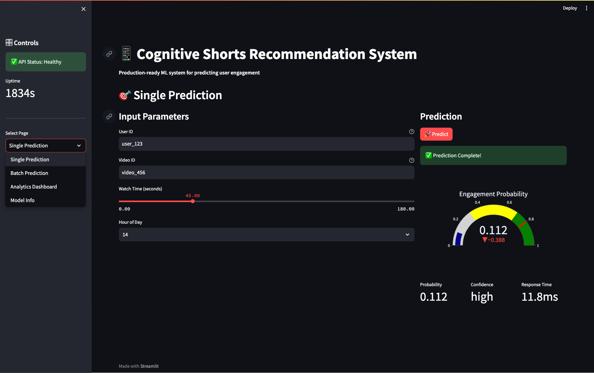

# Cognitive Shorts Recommendation System

这是一个端到端的“单条用户—视频互动预测”系统：原始 CSV 经过特征处理，四种分类模型在同一验证集上比较，最佳模型由 FastAPI 提供预测服务，Streamlit 页面负责交互和展示。



## 理解项目

### 1. 我们到底在预测什么？

一条样本代表某个用户观看某个视频。标签 `target_engaged=1` 表示该次观看发生过至少一种主动互动：点赞、分享、评论、关注创作者或重播；否则为 0。接口返回的是发生主动互动的概率，而不是直接复用数据中的 `engagement_score`。

### 2. 三张原始表各做什么？

- `users.csv`：25,000 个用户的画像和历史统计。
- `videos.csv`：35,000 个视频的内容与累计统计。
- `interactions.csv`：500,000 次观看流水，也是标签来源。

离线阶段把交互与用户、视频快照连接，得到模型能读的 `processed_interactions.csv`。线上阶段只接收 `user_id`、`video_id`、`watch_time` 和 `hour_of_day`，后端再从用户/视频快照补齐同一套特征。

### 3. 数据如何走完整条链路？

```text
users.csv + videos.csv + interactions.csv
                    │
                    ▼
       processed_interactions.csv
                    │
                    ▼
   4 个候选模型比较（ROC-AUC）
                    │
                    ▼
 best_model.joblib + model_metadata.json
                    │
          FastAPI /predict
                    │
          Streamlit 页面展示
```

### 4. 为什么不能直接拿 `engagement_score` 做特征？

因为它来自本次交互结果，相当于考试时把答案放进题目。工程中明确排除了 `liked`、`shared`、`commented`、`followed_creator`、`replayed` 和 `engagement_score`，只把前端输入及请求时可查到的用户/视频快照用于训练。

## 目录说明

```text
app.py                         Streamlit 前端
src/single_prediction/
  features.py                 离线/在线共享特征定义
  prepare_data.py             数据处理
  train.py                    四模型训练和选择
  api.py                      FastAPI 服务
scripts/                       便捷命令入口
tests/                         基础自动测试
data/                          原始数据与生成的训练表
models/                        生成的模型和元数据（不提交）
```

## 从零运行

项目要求 Python 3.10–3.13。以下命令在 macOS/Linux 中执行；Windows 可把激活命令换成 `.venv\\Scripts\\activate`。

```bash
python3.12 -m venv .venv
source .venv/bin/activate
python -m pip install --upgrade pip
python -m pip install -r requirements-dev.txt
python -m pip install -e .
```

确认 `data/users.csv`、`data/videos.csv`、`data/interactions.csv` 已存在，然后依次运行：

```bash
python -m single_prediction.prepare_data
python -m single_prediction.train
pytest
```

训练会输出四个模型的 ROC-AUC、log loss、accuracy 和 F1，并把 ROC-AUC 最高者保存为 `models/best_model.joblib`。完整 50 万行训练会明显慢于快速演示；只检查链路时可使用：

```bash
python -m single_prediction.prepare_data --max-rows 10000
python -m single_prediction.train --max-rows 10000
```

注意：烟雾训练会覆盖本地模型工件。课程最终结果请重新用完整数据运行前两条无 `--max-rows` 的命令。

## 启动与操作

开两个终端并激活同一个 `.venv`：

```bash
uvicorn single_prediction.api:app --reload --host 127.0.0.1 --port 8000
```

```bash
streamlit run app.py
```

浏览器打开 `http://localhost:8501`。可使用数据中真实存在的默认值 `user_000001` 和 `video_0000001`。API 文档位于 `http://127.0.0.1:8000/docs`，健康检查位于 `http://127.0.0.1:8000/health`。

请求示例：

```bash
curl -X POST http://127.0.0.1:8000/predict \
  -H 'Content-Type: application/json' \
  -d '{"user_id":"user_000001","video_id":"video_0000001","watch_time":45,"hour_of_day":14}'
```

## 验收路线

1. 运行数据处理，确认输出行数与输入交互行数一致、标签正例率合理。
2. 运行训练，确认四个模型都有指标、最佳模型和元数据文件已生成。
3. 运行 `pytest`，确认特征标签、在线查表和置信度规则通过。
4. 启动 API，检查 `/health` 中 `status` 为 `healthy`。
5. 对真实 ID 调用 `/predict`，检查概率在 0–1、耗时和模型版本存在。
6. 输入未知 ID、非法小时或负观看时长，确认返回清晰的 404/422 错误。
7. 启动 Streamlit，完成一次页面预测并展开 JSON。

## GitHub 本地准备与数据限制

当前 `.gitignore` 会排除虚拟环境、密钥、生成模型、处理后数据以及 139 MB 的 `data/interactions.csv`。GitHub 普通 Git 拒绝超过 100 MB 的单文件，因此不要强行提交该 CSV。可选方案：

- 课程仓库只提交代码、小型元数据和说明，另行提供数据下载方式；或
- 经课程允许后使用 Git LFS：`git lfs track "data/interactions.csv"`，并提交生成的 `.gitattributes`。

创建远程仓库后，推荐通过 GitHub CLI 的浏览器授权 `gh auth login --web`，或使用系统凭据管理器保存细粒度 token。不要把密码或 token 写入代码、`.env`、聊天消息或 Git 历史。本项目不会代替你创建远程仓库或上传。

本地发布前可检查：

```bash
git status
git check-ignore -v data/interactions.csv models/best_model.joblib .env
git diff --check
```
